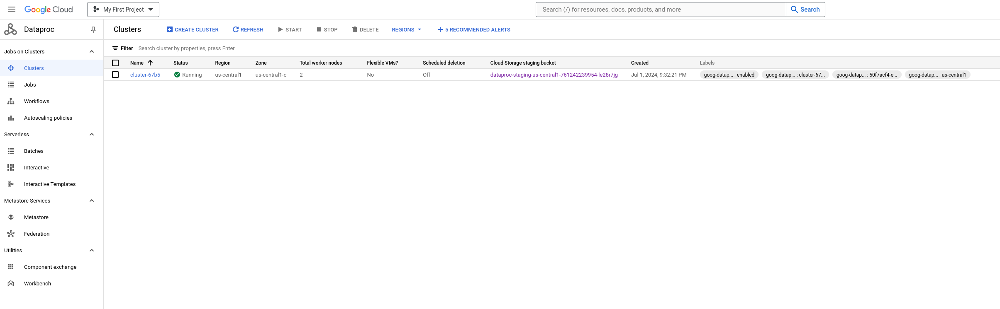
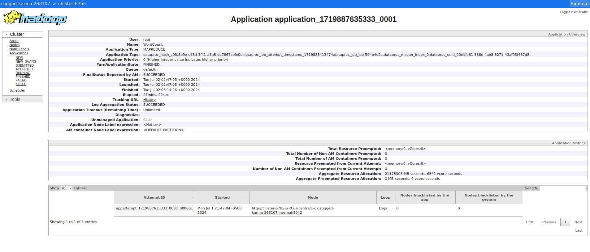

# Please add your team members' names here. 

## Team members' names 

1. Student Name: Valentin Rodriguez

   Student UT EID: var998

2. Student Name: Eden Schelling

   Student UT EID: das5983

3. Student Name: Alexander Billiot

   Student UT EID: aab4585

4. Student Name: Ziyu Zhao

   Student UT EID: zz6678

##  Course Name: CS378 - Cloud Computing 

##  Unique Number: 51515
    


# Add your Project REPORT HERE 

## Task 1 output:  

| Hour | # of errors |
| :-: | :-: |
| 19 | 214716 |
| 18 | 207422 |
| 21 | 201896 |
| 20 | 201722 |
| 22 | 195645 |
| 17 | 176694 |
| 23 | 175269 |
| 14 | 175047 |
| 15 | 169559 |
| 13 | 166982 |
| 12 | 166108 |
| 11 | 157009 |
| 09 | 153718 |
| 10 | 150248 |
| 08 | 149153 |
| 16 | 148995 |
| 00 | 139926 |
| 07 | 125771 |
| 01 | 106513 |
| 02 | 81455 |
| 06 | 77088 |
| 03 | 62668 |
| 04 | 48068 |
| 05 | 41366 |

```
19	214716
18	207422
21	201896
20	201722
22	195645
17	176694
23	175269
14	175047
15	169559
13	166982
12	166108
11	157009
09	153718
10	150248
08	149153
16	148995
00	139926
07	125771
01	106513
02	81455
06	77088
03	62668
04	48068
05	41366
Line Errors	3438
```

## Task 2 output:  

| Medallion | error rate |
| :-: | :-: |
| 00DC83118CA675B9A2876C35E3398AF5 | 1.0 |
| 0147DFA9175C379E38CAEF5D165D4CAD | 1.0 |
| FF96A951C04FBCEDE5BCB473CF5CBDBF | 1.0 |
| FF96A951C04FBCEDE5BCB473CF5CBDBF | 1.0 |
| 00AC8ED3B4327BDD4EBBEBCB2BA10A00 | 1.0 |

```
00DC83118CA675B9A2876C35E3398AF5	1.0
0147DFA9175C379E38CAEF5D165D4CAD	1.0
FE757A29F1129533CD6D4A0EC6034106	1.0
FF96A951C04FBCEDE5BCB473CF5CBDBF	1.0
00AC8ED3B4327BDD4EBBEBCB2BA10A00	1.0
```


## Task 3 output:  

| Driver ID | Earning per Min |
| :-: | :-: |
| FD2AE1C5F9F5FBE73A6D6D3D33270571 | 1.1375 |
| A7C9E60EEE31E4ADC387392D37CD06B8 | 0.35 |
| D8E90D724DBD98495C1F41D125ED029A | 0.175 |
| E9DA1D289A7E321CC179C51C0C526A73 | 0.06425 |
| 74071A673307CA7459BCF75FBD024E09 | 0.058333333333333334 |
| 95A921A9908727D4DC03B5D25A4B0F62 | 0.058333333333333334 |
| 42AB6BEE456B102C1CF8D9D8E71E845A | 0.05320833333333333 |
| 28EAF0C54680C6998F0F2196F2DA2E21 | 0.05 |
| FA587EC2731AAB9F2952622E89088D4B | 0.05 |
| E79402C516CEF1A6BB6F526A142597D4 | 0.04015151515151515 |


```
FD2AE1C5F9F5FBE73A6D6D3D33270571	1.1375
A7C9E60EEE31E4ADC387392D37CD06B8	0.35
D8E90D724DBD98495C1F41D125ED029A	0.175
E9DA1D289A7E321CC179C51C0C526A73	0.06425
74071A673307CA7459BCF75FBD024E09	0.058333333333333334
95A921A9908727D4DC03B5D25A4B0F62	0.058333333333333334
42AB6BEE456B102C1CF8D9D8E71E845A	0.05320833333333333
28EAF0C54680C6998F0F2196F2DA2E21	0.05
FA587EC2731AAB9F2952622E89088D4B	0.05
E79402C516CEF1A6BB6F526A142597D4	0.04015151515151515
```


# Project Template

# Running:






## Create a JAR Using Maven 

To compile the project and create a single jar file with all dependencies: 
	
```	cd task1 && mvn clean package ```
```	cd task2 && mvn clean package ```
```	cd task3 && mvn clean package ```


## Run your application
Inside your shell with Hadoop

Running as Java Application:

```java -jar task1/target/MapReduce-WordCount-example-0.1-SNAPSHOT-jar-with-dependencies.jar SOME-Text-Fiel.txt task1/tempfile task1/output``` 
```java -jar task2/target/MapReduce-WordCount-example-0.1-SNAPSHOT-jar-with-dependencies.jar SOME-Text-Fiel.txt task2/tempfile task2/output``` 
```java -jar task3/target/MapReduce-WordCount-example-0.1-SNAPSHOT-jar-with-dependencies.jar SOME-Text-Fiel.txt task3/tempfile task3/output``` 

Or has hadoop application

```hadoop jar your-hadoop-application.jar edu.cs.utexas.HadoopEx.WordCount arg0 arg1 ... ```


## Create a single JAR File from eclipse


Create a single gar file with eclipse 

*  File export -> export  -> export as binary ->  "Extract generated libraries into generated JAR"
